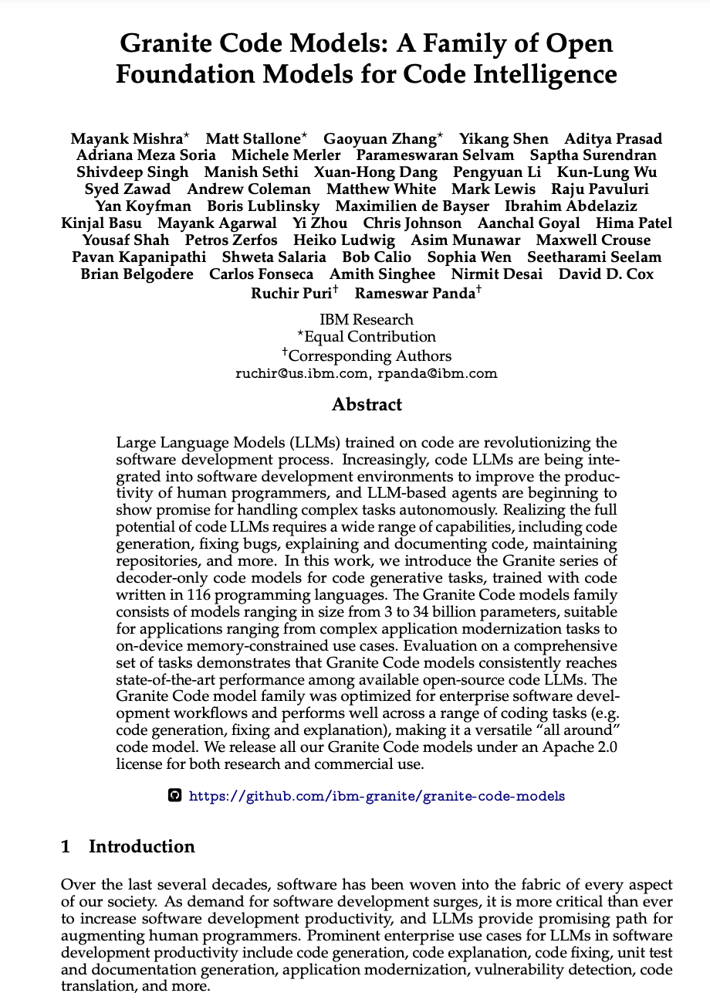
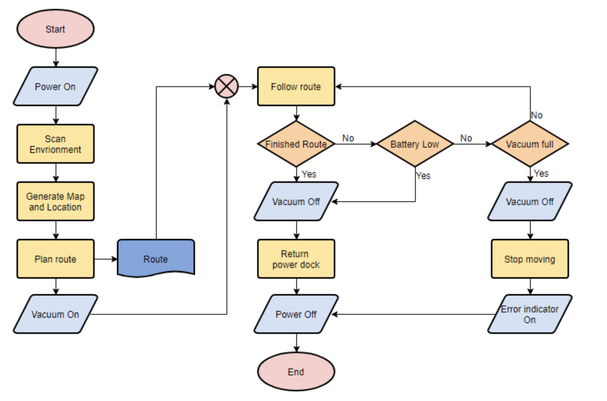
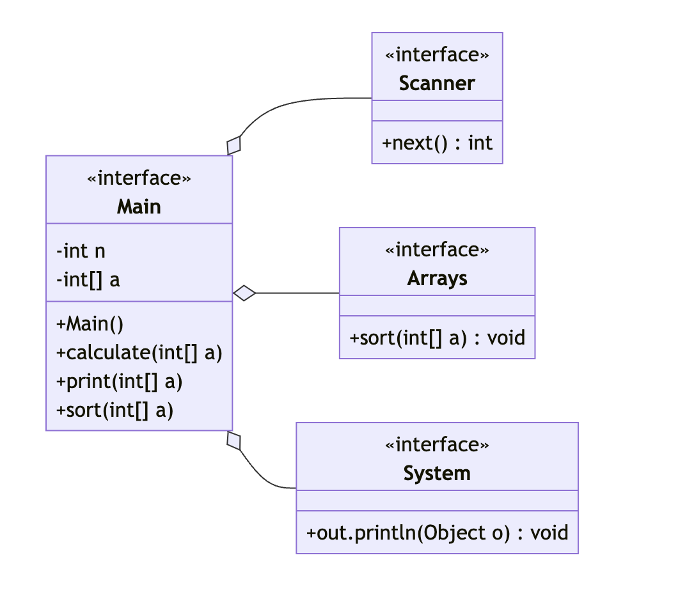

# watsonx.ai MultiModal Use Cases

## Use Case 1: OCR



- sample output

```text
The page contains a title, "Granite Code Models: A Family of Open Foundation Models for Code Intelligence," followed by a list of authors and their affiliations. The main content of the page is an abstract that describes the purpose and benefits of Granite Code models, which are large language models trained on code to improve software development productivity. The abstract highlights the potential of these models to handle complex tasks autonomously and their ability to perform well across a range of coding tasks.

The page also includes a link to the GitHub repository where the models can be accessed, as well as a brief introduction that provides context for the development of Granite Code models. Overall, the page appears to be a promotional material for the Granite Code models, highlighting their capabilities and potential applications in software development.

Here is the full text from the page:

**Granite Code Models: A Family of Open Foundation Models for Code Intelligence**
```

## Use Case 2: WebPage -> HTML


- sample output

```html
<!DOCTYPE html>
<html lang="en">
<head>
    <meta charset="UTF-8">
    <meta name="viewport" content="width=device-width, initial-scale=1.0">
    <title>IBM Sustainability Solutions</title>
    <link rel="stylesheet" href="styles.css">
</head>
<body>
    <header>
        <nav>
            <ul>
                <li><a>Products</a></li>
                <li><a>Solutions</a></li>
                <li><a>Consulting</a></li>
                <li><a>Support</a></li>
                <li><a>Think</a></li>
                <li><a>TechXchange 2024</a></li>
            </ul>
        </nav>
    </header>
    <main>
```

### Use Case 3: Diagram -> Discription



- sample output

```yaml
graph TD
    Start[Power On]
    Follow route
    Generate Map and Location
    Plan route
    Scan Environment
    Vacuum Off
    Battery Low
    No
    Vacuum On
    Power Off
    Return power block
    Vacuum Off
    Stop moving
    Error indicator On
    End
```

### Use Case 4: Diagram -> Source Code



- sample output

**Main.java**
```java
public class Main {
    public static void main(String[] args) {
        Scanner scanner = new Scanner();
        Arrays arrays = new Arrays();
        System system = new System();

        // Initialize variables
        int n = scanner.nextInt();
        int[] a = arrays.createArray(n);

        // Calculate and print results
        arrays.calculate(a);
        system.println("Results:");
        for (int i = 0; i < n; i++) {
            system.println(a[i]);
        }
    }
}
```

**Scanner.java**
```java
import java.util.Scanner;

public class Scanner {
    private Scanner scanner = new Scanner(System.in);

    public int nextInt() {
        return scanner.nextInt();
    }
}
```

**Arrays.java**
```java
public class Arrays {
    public int[] createArray(int size) {
        return new int[size];
    }

    public void calculate(int[] array) {
        for (int i = 0; i < array.length; i++) {
            array[i] = i * 2;
        }
    }

    public void sort(int[] array) {
        // Sorting logic can be implemented here
    }
}
```

**System.java**
```java
public class System {
    public void println(String message) {
        System.out.println(message);
    }

    public void println(int value) {
        System.out.println(value);
    }
}
```